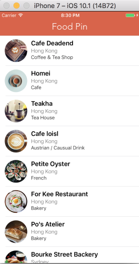

# FoodPinDemo
My exercises while reading the appcoda book.



## Some notes

### tags
I will create git tag for some milestones

1. `chapter12_pretty_coo`: list view with a very simple detail view.
2. `plain_detail_view`: a usable detail view(table like)
3. `polished-app`: a beautiful app.

### basic
1. change cell style from basic to custom.
2. change table view row height from default(44) to 80
3. change cell row height to 80 (只要勾上custom会自动变成80)
4. drag an image view to the cell (14,10) 60*60
5. Add 3 labels: Name(Headline), Location(Light, 14, Dark Gray), Type(Light, 13)
6. Stackview the 3 labels, spacing: 0 -> 1
7. Stackview the image and above stackview, spacing: 0 -> 10, Alignment: Top
8. 设置最外层的stack view 和cell边距的上左下右分别为2, 6, 1.5, 0这时stackview会填充整个cell, 但是图片被横向拉伸了
9. 在outline中ctrl水平拖动image view到自身, 设置width和height为60

### basic 2

1. 在outline的tableviewCell上点右键可以看到这个cell中定义的所有outlet
2. UIKit中所有View都自带CALayer, 这个layer对象可以控制view的背景色,边框, 透明度, 圆角

### basic 3
1. 将image view在outline中拖动到cell之上
2. aspect fill + clip to bounds
3. cell中加两个Label: Field(Medium) + Value
4. stackview这两个label
5. 见251页,给stackview设置constraints(spacing以及垂直居中)
6. 这时会产生一个layout warning: 不能给两个label设置相同的hugging priority, 原因是我们只给stack view设置了constraints,而让stack view自动管理它所包含label的constraints, 结果是Field被拉伸了, Value大小保持正常. 这是因为Field和Value有相同的hugging priority:251, 只要把Field的priority设置的更高比如261, 那么Field就会保持自己的本来大小(intrinsic size), 而Value则被拉伸.

### 设置圆角:

```swift
cell.thumbnailImageView.layer.cornerRadius = 30.0
cell.thumbnailImageView.clipsToBounds = true                                                                                             
```
或者选中image view在identity inspector中新增一个runtime属性layer.cornerRadius值为Number:30
并在attributes inspector中勾选clip to bounds

### 美化tableview/表格线
```swift
// set table view bg color
tableView.backgroundColor = UIColor(white: 240.0/255, alpha: 0.2)
// remove empty rows
tableView.tableFooterView = UIView(frame: CGRect.zero)
//set separator color
tableView.separatorColor = UIColor(white: 240.0/255, alpha: 0.8)

```

## 美化nav bar
1) 在didFinishLaunchingWithOptions设置nav bar的背景色

```swift
// nav bar bg color
UINavigationBar.appearance().barTintColor = UIColor(red: 216.0/255, green: 74.0/255, blue: 32.0/255, alpha: 1.0)

// nav bar button style(可以点击的)
UINavigationBar.appearance().tintColor = UIColor.white

// nav title style
if let barFont = UIFont(name: "Avenir-Light", size: 24.0) {

UINavigationBar.appearance().titleTextAttributes = [NSForegroundColorAttributeName: UIColor.white, NSFontAttributeName: barFont]
}
```
Navbar的背景色为UINavigationBar.appearance().barTintColor, 但是它还有一个backgroundColor属性,呃.

2) 在segue.source这边viewDidLoad中重新定义后退按钮(不带文字)

```swift
navigationItem.backBarButtonItem = UIBarButtonItem(title: "", style: .plain, target: nil, action: nil)
```

3) 在detail view的viewDidLoad中设置nav bar title

```swift
title = restaurant.name
```

## 美化status bar
修改status bar黑色文字为白色, 两种方式:

1) ViewController逐个修改, 覆盖preferredStatusBarStyle即可(.lightContent),我设置了但是不起作用, 参考这里的[solution][1], 在 viewDidLoad加上`navigationController?.navigationBar.barStyle = .blackTranslucent`


2) 全局修改

1. Info.plist设置`View controller-based status bar appearance=NO`
2. AppDelegate中`UIApplication.shared.statusBarStyle = .lightContent`

### 自适应大小的cell
1. 将Value label的Lines从1改成0, 这样Label可以显示多行文字
2. tableView.estimatedHeight改成它的预计行高值(36/44), 以优化性能, 默认值是0
3. tableView.rowHeight = UITableViewAutomaticDimension, 从iOS10开始, 这已经是默认值
4. 这时console会有个layout warning, 解决办法是给这个cell中包含的那个stack view设置top和bottom约束(之前已经给它设定了leading/trailing和center vertically的约束,但是对于自适应大小的cell来说还不够)

### 圆形button
1. title=blank, image=check, (type=system, tint=white设置按钮的颜色)
2. 点pin按钮,设置top=8,right=8,width=28,height=28

### 全屏背景
1. drag a new view controller
2. drag image view onto it, resize to full screen
3. add missing constraints, 但是Xcode8.1上这个选项是灰的, 最后用了reset to suggested constraints

### 半屏窗口
1. container view: drag a view object onto the image view(x=53, y=40, 269*420)

### 右上角关闭按钮
1. Drag a button(top=-13, right=-12, 28*28), title=blank, image=cross
2. 在前一屏中加入`@IBAction func close(segue: UIStoryboardSegue) {}`这句代码告诉Xcode这个viewController可以被unwind
3. Ctrl drag this close button to the exit button on this review scene, and select `closeWithSegue:`

### 让全屏背景模糊

在viewDidLoad中加入

```swift
let blurEffect = UIBlurEffect(style: .dark)
let blurEffectView = UIVisualEffectView(effect: blurEffect)
blurEffectView.frame = view.bounds
backgroundImageView.addSubview(blurEffectView)

```
就是给ImageView加上一个大小相同的subview, 上面代码中第三行view变量是所有UIViewController都有的, 表示这个ViewController管理的顶层view对象.

### Container view大小变换(scaleX)
怎么将view的大小变成0? 大小值用`CGAffineTransform`表示

1. 大小为0:CGAffineTransform(scaleX: 0, y: 0)
2. 原始大小及位置:CGAffineTransform.indentiy
3. 在viewDidLoad中将view的transform属性设置为0
4. 在viewDIdAppear中将view的transform属性设置为原始值.


简单动画

```swift
UIView.animate(withDuration: 0.3, animations: {
self.containerView.transform = CGAffineTransform.identity
})
```

Spring动画(UIView.animate多加些参数)

```swift
UIView.animate(withDuration: 0.3, delay: 0.0, usingSpringWithDamping: 0.3, initialSpringVelocity: 0.2, options: .curveEaseOut, animations: {
self.containerView.transform = CGAffineTransform.identity
}, completion: nil)
```

### 组合变换scale + translate(viewDidLoad)

```swift
let scaleTransform = CGAffineTransform(scaleX: 0, y: 0)
let translateTransform = CGAffineTransform(translationX: 0, y: -1000)
let combineTransform = scaleTransform.concatenating(translateTransform)
containerView.transform = combineTransform
```

CGAffineTransform(translationX:y:)中的x, y都是相对于目标原始位置的偏移量, 并不是相对屏幕左上角.

### 3 more unwind segue(with identifier)
在detailViewController中加入`@IBAction func ratingButtonTapped(segue: UIStoryboardSegue) {}`
分别拖动review界面上的三个评价按钮到exit button, 全部选择ratingButtonTappedWithSegue:, 这样在outline中会多出三个unwind segue, 设定它们的identifier为great/good/dislike


```swift
@IBAction func ratingButtonTapped(segue: UIStoryboardSegue) {
if let rating = segue.identifier {
restaurant.isVisited = true

switch rating {
case "great": restaurant.rating = "love it."
// ...
default: break
}
}

tableView.reloadData()
}
```

### Static Map
1. Switch ON map capability
2. Drag a map view onto the table view footer(height=135)
3. We want a static map, so untick all Allows(zooming, scrolling...)
4. That's all

### Fullscreen map
1. Drag a new view controller
2. Drag a new map view, resize it to be full-screen, add missing constraints
3. Ctrl drag from detail view controller to this newly created controller, segue.identifier=showMap(为什么不从static map拖到map view controller, 这是因为table header和footer都没法点击, 只能通过代码来打开新的view controller

### 给static map绑定tap事件
在detail view的viewDidLoad中

```swift
let tapGestureRecognizer = UITapGestureRecognizer(target: self, action: #selector(showMap))
mapView.addGestureRecognizer(tapGestureRecognizer)
```

performSegue以编程的方式触发transition.

```swift
func showMap(){
performSegue(withIdentifier: "showMap", sender: self)
}
```
注意是UITapGestureRecognizer而非UIGestureRecognizer.

### 地址转coordinate


地址转coordinate: 你输入一个文本地址, 地图服务器通常会返回一堆相似的地址, 这堆文本地址叫placemarks

```swift
let geoCoder = CLGeocoder()
geoCoder.geocodeAddressString(restaurant.location, completionHandler: {
placemarks, error in
let coordinate = placemarks?[0].location?.coordinate
})
```

在static map上标记位置.

```swift
// 搜索地址
let geoCoder = CLGeocoder()
geoCoder.geocodeAddressString("湖北省鄂州高中", completionHandler: {
placemarks, error in
if error != nil { print(error!); return }
// 地址转坐标
if let coordinate = placemarks?[0].location?.coordinate {
// 在那个位置显示一个pin
let annotation = MKPointAnnotation()
annotation.coordinate = coordinate
self.mapView.addAnnotation(annotation)

// 以那个pin为中心显示多大的区域, 半径250米
let region = MKCoordinateRegionMakeWithDistance(coordinate, 250, 250)
self.mapView.setRegion(region, animated: true)
}

})
```

显示多个pin, 并选择一个弹出气泡提示

```swift
if let coordinate = placemarks?[0].location?.coordinate {
let annotation = MKPointAnnotation()
annotation.coordinate = coordinate
annotation.title = "湖北省鄂州高中"
annotation.subtitle = "滨湖南路特一号"
//self.mapView.addAnnotation(annotation)
self.mapView.showAnnotations([annotation], animated: true)
self.mapView.selectAnnotation(annotation, animated: true)
}
```
和上面的代码区别很小(并且这种情况下map会选择最优region)

### NEW Form
1. 5 cells, rowHeight=250,72,72,72,72
2. image view (64*64) center
3. text field(placeholder, no border, width = 339)
4. select labels + text fields, add missing constraints
5. YES/NO buttons, color=white, bgColor=red/gray
6. Embed in navigation controller

### + -> NEW Form
1. NEW Form为什么要套在nav controller中?(是为了在左上角加上Cancel按钮)
2. Ctrl drag + 号到nav controller, 类型为Present Modally, identifier=addRestaurant
3. HomeController中写上`@IBAction func unwindToHomeScreen(segue: UIStoryboardSegue) {}`
4. New Form左上弄个Cancel按钮, 并拖到Exit button上新增unwind segue

### 打开ImagePicker
因为image view是放在第一个cell中. 只要实现didSelectRowAt, 并且在其中present系统内置的UIImagePickerController


```swift
if indexPath.row == 0 {
if UIImagePickerController.isSourceTypeAvailable(.photoLibrary) {
let imagePicker = UIImagePickerController()
imagePicker.allowsEditing = false
imagePicker.sourceType = .photoLibrary

present(imagePicker, animated: true, completion: nil)
}
}

```

从iOS10开始, 需要在Info.plist中显示指定打开图库的理由, 以便得到用户允许.`Privacy - Photo Library Usage Description=就是要看!`

直接把`.photoLibrary`改成`.camera`可以拍照取图

### ImagePicker回调
ImagePicker的delegate必须同时满足两个接口:`UIImagePickerControllerDelegate, UINavigationControllerDelegate`
在didSelectRow中present前`imagePicker.delegate = self`, 然后实现下面这个回调函数即可
UIImagePickerControllerDelegate.didFinishPickingMediaWithInfo

```swift
func imagePickerController(_ picker: UIImagePickerController, didFinishPickingMediaWithInfo info: [String : Any]) {
if let selectedImage = info[UIImagePickerControllerOriginalImage] as? UIImage {
photoImageView.image = selectedImage
photoImageView.contentMode = .scaleAspectFill
photoImageView.clipsToBounds = true
}

dismiss(animated: true, completion: nil)
}
```
在didSelectRowAt中present, 在这个回调中dismiss(这个dismiss是关闭从当前view controller中打开的modal对话框,并不是关闭自身)

### NSLayoutConstraint
A layout constraint defines a relationship between two user interface objects用公式表示:
`photoImageView.leading = superview.leading * 1 + 0`
用代码实现这个公式.

```swift
let leading = NSLayoutConstraint(item: photoImageView, attribute: .leading, relatedBy: .equal, toItem: photoImageView.superview, attribute: .leading, multiplier: 1, constant: 0)
leading.isActive = true
```

### 关闭view controller两种办法

```swift
@IBAction func saveRestaurant() {
if checkForm() {
//dismiss(animated: true, completion: nil)
performSegue(withIdentifier: "unwindToHomeScreen", sender: self)

} else {
```
因为我想沿用Cancel按钮使用的unwind segue,在用第2种方法的时候碰到了找不到unwind segue identifier的问题, 参见[SO]解决: 虽然unwind segue的Action segue是根据你所定义的func名字生成的, 但是identifier还是需要自己指定.

### CoreData Data Model
新建一个Data Model: `FoodPinDemo.xcdatamodeld`, Entity改名为Restaurant, Class改名为RestaurantMO(这个Managed Object类编译项目会自动生成, project中看不到)

RestaurantMO所有属性都变成了optional, 并且image(binary)的类型为NSData.

主要变化

1. UIImage(named: restaurant.image) -> UIImage(data: restaurant.image as! Data)
2. resturant.location -> restaurant.location!
3. restaurant.rating -> restaurant.rating ?? ""

之前的Restaurant.swift废掉, 可以删除.

### CoreData CRUD
findAll, 在viewWillAppear中加入:

```swift
let appDelegate = UIApplication.shared.delegate as! AppDelegate
let ctx = appDelegate.persistentContainer.viewContext
let request: NSFetchRequest<RestaurantMO> = RestaurantMO.fetchRequest()
let restaurants = try! ctx.fetch(request)
```

简单封装的工具类CD(save传的参数没有用到, 只是为了好看!):

```swift
class CD {

class var appDelegate: AppDelegate {
return UIApplication.shared.delegate as! AppDelegate
}
class var ctx: NSManagedObjectContext {
return appDelegate.persistentContainer.viewContext
}

class func delete<T: NSManagedObject>(_ o: T) {
ctx.delete(o)
save(o)
}

class func save(_ _: NSManagedObject) {
appDelegate.saveContext()
}

class func image2Data(image: UIImage?) -> NSData? {
if let image = image {
if let imageData = UIImagePNGRepresentation(image) {
return NSData(data: imageData)
}
}

return nil
}
```
这个类间歇性的报ambiguous use of x 的错误, 但是程序能正常运行, 怀疑是Xcode8.1的bug.

增删改查:

```swift
// create (AddRestaurantController)
let restaurant = RestaurantMO(context: CD.ctx)
restaurant.name = name
restaurant.type = type
restaurant.image = CD.image2Data(image: photoImageView.image)
CD.save(restaurant)

// delete (editActionsForRowAt)
let restaurant = restaurants.remove(at: indexPath.row)
tableView.deleteRows(at: [indexPath], with: .fade)
CD.delete(restaurant)

// update (ratingButtonTapped)
restaurant.isVisited = true
CD.save(restaurant)

// find all (viewWillAppear)
let request: NSFetchRequest<RestaurantMO> = RestaurantMO.fetchRequest()
restaurants = try! CD.ctx.fetch(request)
tableView.reloadData()
```
待研究: http://stackoverflow.com/questions/37810967/how-to-apply-the-type-to-a-nsfetchrequest-instance

### Search bar
以为是拖的, 没想到是在viewDidLoad中加两行代码

```swift
searchController = UISearchController(searchResultsController: nil)
tableView.tableHeaderView = searchController.searchBar
```

### 处理Search
1) 按套路是用delegate实现,然而并没有使用UISearchControllerDelegate,用的是UISearchResultsUpdating, 在viewDidLoad中加入

```swift
searchController.searchResultsUpdater = self
searchController.dimsBackgroundDuringPresentation = false
```
第二句是让search结果弹出时, 背景模糊(因为我们没有用单独的view来显示查询结果, 没有背景层, 在此设为false)

2) 处理search的回调函数: UISearchResultsUpdating.updateSearchResults(for:)

```swift
func updateSearchResults(for searchController: UISearchController) {
if let text = searchController.searchBar.text {
searchResults = restaurants.filter { restaurant -> Bool in
if let name = restaurant.name {
let isMatch = name.localizedCaseInsensitiveContains(text)
return isMatch
}

return false
}
tableView.reloadData()
}
}
```

3) 在先前用到restaurants的地方依情况选用searchResults, 包含numberOfRowsInSection, cellForRowAtIndexPath,  prepare(for:), 使用`searchController.isActive`判断当前是否处在search模式下.

4) 在Search时禁用Delete/Share功能

```swift
override func tableView(_:canEditRowAt:) -> Bool {
if searchController.isActive {
return false
}
return true
}
```
### 美化search bar
viewDidLoad设置前景色(Cancel按钮), 背景色.

```swift
let searchBar = searchController.searchBar
searchBar.placeholder = "Search restaurants..."
searchBar.tintColor = UIColor.white
searchBar.barTintColor = UIColor(red: 218.0/255, green: 100.0/255, blue: 70.0/255, alpha: 1.0)
tableView.tableHeaderView = searchBar
```

发现search bar上面会出现很丑的边框, 参考了作者的代码,发现作者和书中写的不一样, 最终选的灰色`searchBar.barTintColor = UIColor(white: 236.0/255, alpha: 1.0)`, 去掉边框的解决办法[参考这里][search_bar_border](未试)

### UIPageViewController(幻灯片)
UIPageViewController(我喜欢叫它Page Container)是多个View的容器(类似Navigation Controller), 用来管理它所包含的多个子view, 但是由于子view的相似性, 我们只用拖一个View Controller做为模版(我叫它Single Page).

#### 创建Page Container
1) 拖一个page view controller

2) Transition style从`Page Curl(翻书效果)`改成`Scroll`

3) Storyboard ID: PageContainer

4) 在list view的viewDidAppear中显示page container

```swift
func viewDidAppear() {
if let pageContainer = storyboard?.instantiateViewController(withIdentifier: "PageContainer") as? PageContainer {
present(pageContainer, animated: true, completion: nil)
}
}
```

5) 在page container的viewDidLoad中加载第一个page

6) 使用UIPageViewController.setViewControllers指定显示哪个page, 实现DataSource接口中的两个方法viewControllerBefore, viewControllerAfter设定向前和向后翻页时显示哪个page.

```swift
class PageContainer: UIPageViewController, UIPageViewControllerDataSource {

var pageHeadings = ["Personalize", "Locate", "Discover"]
var pageImages = ["foodpin-intro-1", "foodpin-intro-2", "foodpin-intro-3"]
var pageContent = ["content1","2","3"]

override func viewDidLoad() {
dataSource = self
if let startingPage = page(at: 0) {
setViewControllers([startingPage], direction: .forward, animated: true, completion: nil)
}
}

func pageViewController(_ pageViewController: UIPageViewController, viewControllerBefore viewController: UIViewController) -> UIViewController? {
var index = (viewController as! SinglePage).index
index -= 1

return page(at: index)
}

func pageViewController(_ pageViewController: UIPageViewController, viewControllerAfter
viewController: UIViewController) -> UIViewController? {
var index = (viewController as! SinglePage).index
index += 1

return page(at: index)

}

func page(at index: Int) -> SinglePage? {
if index < 0 || index >= pageHeadings.count {
return nil
}

if let page = storyboard?.instantiateViewController(withIdentifier: "SinglePage")  as? SinglePage{
page.imageFile = pageImages[index]
page.heading = pageHeadings[index]
page.content = pageContent[index]
page.index = index

return page
}

return nil
}

}
```


#### 定义Single Page模版
Single Page是一个简单的View Controller,在Page Container的page(at)方法中动态的创建设置各个属性值并做为viewControllerBefore的返回值.

1. Drag a view controller, view bgcolor=#c0392b
2. Label("Personalize")=top, hCenter
3. Image View(300*232)=Aspect Ratio
4. Label("Pin your ...",align=center, lines=0)=w282 h64
5. Storyboard ID = SinglePage
6. Set custom class, bind IBOutlets

```swift
class SinglePage: UIViewController {
@IBOutlet weak var headingLabel: UILabel!
@IBOutlet weak var contentLabel: UILabel!
@IBOutlet weak var contentImageView: UIImageView!

var index = 0
var heading = ""
var imageFile = ""
var content = ""

override func viewDidLoad() {
super.viewDidLoad()

headingLabel.text = heading
contentLabel.text = content
contentImageView.image = UIImage(named: imageFile)
}

}

```

### 幻灯片底部page indicator
在Page Container中实现UIPageViewControllerDataSource中的两个接口即可.

```swift
func presentationCount(for pageViewController: UIPageViewController) -> Int {
print("presentationCount: \(pageHeadings.count)")
return pageHeadings.count
}

func presentationIndex(for pageViewController: UIPageViewController) -> Int {
print("presentationIndex")

if let page = storyboard?.instantiateViewController(withIdentifier: "SinglePage")  as? SinglePage {
print("page index is: \(page.index)")
return page.index
}

print("no page found, return 0")
return 0
}
```
还不太理解两个方法的调用时机, 实测presentationIndex永远都是返回0, 感觉很诡异, 这两个方法造中出来indicator样式太丑,无视.

### 自定义的Page indicator
1. 拖一个page control到single page底部
2. 设置pages=3(默认值), add missing constraints, 设置outlet.
3. 在single Page的viewDidLoad中`pageControl.currentPage = index` 
4. That's all

### 幻灯片上的NEXT/DONE按钮
1) 拖个button到最右下角(bottom=7, right=0), 设置outlet

2) 在single page的viewDidLoad中动态修改按钮的文本

```swift
switch index {
case 0...1:
forwardButton.setTitle("NEXT", for: .normal)
case 2:
forwardButton.setTitle("DONE", for: .normal)
default:
break
}
```

3) 给NEXT按钮绑定点击事件


```swift
@IBAction func buttonTapped(_ sender: UIButton) {
switch index {
case 0...1:
let pageContainer = parent as! PageContainer
pageContainer.forward(index: index)
case 2:
dismiss(animated: true, completion: nil)
default:
break
}
}
``` 

4) PageContainer增加翻页的方法(forward)

```swift
func forward(index: Int) {
if let nextPage = page(at: index + 1) {
setViewControllers([nextPage], direction: .forward, animated: true, completion: nil)
}
}
```


### 仅展示一次幻灯片(UserDefaults)
在DONE按钮的点击事件中,存个值到UserDefaults中:
`UserDefaults.standard.set(true, forKey: "hasViewedWalkthrough")`

在列表页viewDidAppear中判断是否存过,存过直接返回: `if UserDefaults.standard.bool(forKey: "hasViewedWalkthrough") {return}`

### Keywords

1. 取选中行的行号: tableView.indexPathForSelectedRow
2. editActionsForRowAt
3. UITableViewRowAction
4. UIActivityViewController
5. prepare(for:sender:)
6. segue.destination/segue.identifier
7. UINavigationBar.appearance().barTintColor
8. UIApplication.shared.statusBarStyle
9. Dynamic Type - use a text style instead of a fixed font type.
10. CLGeocoder.geocodeAddressString
11. mapView.addAnnotation(MKPointAnnotation)
12. UIImagePickerController
13. NSLayoutConstraint(..).isActive
14. UIApplication.shared.delegate
15. NSData(data: UIImagePNGRepresentation(image))
16. UISearchResultsUpdating
17. String.localizedCaseInsensitiveContains
18. viewDidAppear: present(storyboard?.instantiateViewController(withIdentifier: "PageContainer") as? PageContainer)
19. PageContainer.setViewControllers([startingPage])
20. UIPageViewControllerDataSource.viewControllerBefore
21. storyboard?.instantiateViewController(withIdentifier: "SinglePage")  as? SinglePage
22. PageControl.currentPage = index
23. SinglePage中`let pageContainer = parent as! PageContainer`
24. UserDefaults.standard


### Omitted
1. Swipe to hide
2. MapKit: show image on callout bubble
3. NSFetchedResultsController
4. P393 Search bar延伸阅读

### Xcode tricks

1. How to switch between storyboard and swift file
>View > Show Tab Bar, create a new tab, for one tab, you can open storyboard, for the other, you can open the swift file, then you can use `shift+cmd+]` to switch between interface builder and source code file.

2. Interface builder: Zoom to fit
3. Can directly drag image from Finder to Simulator


[1]: http://stackoverflow.com/questions/19108513/uistatusbarstyle-preferredstatusbarstyle-does-not-work-on-ios-7
[SO]: http://stackoverflow.com/questions/27889645/performseguewithidentifier-has-no-segue-with-identifier
[search_bar_border]: http://stackoverflow.com/questions/19899642/remove-border-of-uisearchbar-in-ios7

