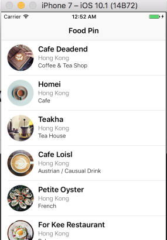

# FoodPinDemo
My exercises while reading the appcoda book.



## Some notes

### tags
I will create git tag for some milestones

1. `chapter12_pretty_coo`: list view with a very simple detail view.
2. `plain_detail_view`: a usable detail view(table like)

### basic
1. change cell style from basic to custom.
2. change table view row height from default(44) to 80
3. change cell row height to 80 (只要勾上custom会自动变成80)
4. drag an image view to the cell (14,10) 60*60
5. Add 3 labels: Name(Headline), Location(Light, 14, Dark Gray), Type(Light, 13)
6. Stackview the 3 labels, spacing: 0 -> 1
7. Stackview the image and above stackview, spacing: 0 -> 10, Alignment: Top
8. 设置最外层的stack view 和cell边距的上左下右分别为2, 6, 1.5, 0这时stackview会填充整个cell, 但是图片被横向拉伸了
9. 在outline中ctrl水平拖动image view到自身, 设置width和height为60

### basic 2

1. 在outline的tableviewCell上点右键可以看到这个cell中定义的所有outlet
2. UIKit中所有View都自带CALayer, 这个layer对象可以控制view的背景色,边框, 透明度, 圆角

### basic 3
1. 将image view在outline中拖动到cell之上
2. aspect fill + clip to bounds
3. cell中加两个Label: Field(Medium) + Value
4. stackview这两个label
5. 见251页,给stackview设置constraints(spacing以及垂直居中)
6. 这时会产生一个layout warning: 不能给两个label设置相同的hugging priority, 原因是我们只给stack view设置了constraints,而让stack view自动管理它所包含label的constraints, 结果是Field被拉伸了, Value大小保持正常. 这是因为Field和Value有相同的hugging priority:251, 只要把Field的priority设置的更高比如261, 那么Field就会保持自己的本来大小(intrinsic size), 而Value则被拉伸.

### 设置圆角:

```swift
cell.thumbnailImageView.layer.cornerRadius = 30.0
cell.thumbnailImageView.clipsToBounds = true                                                                                             
```
或者选中image view在identity inspector中新增一个runtime属性layer.cornerRadius值为Number:30
并在attributes inspector中勾选clip to bounds

### Keywords

1. 取选中行的行号: tableView.indexPathForSelectedRow
2. editActionsForRowAt
3. UITableViewRowAction
4. UIActivityViewController
5. prepare(for:sender:)
6. segue.destination/segue.identifier

### Xcode tricks (my findings!)

#### 1. how to switch between storyboard and swift file
View > Show Tab Bar, create a new tab, for one tab, you can open storyboard, for the other, you can open the swift file, then you can use `shift+cmd+]` to switch between interface builder and source code file, pretty cool!


